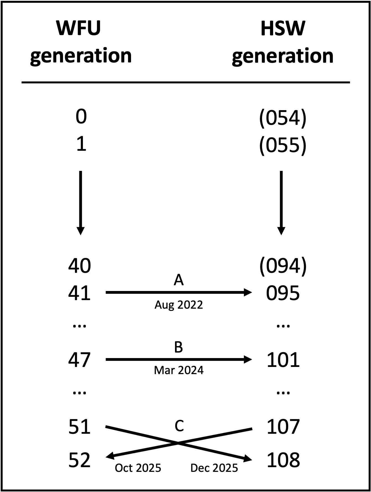

# Breeder selection in HS rats :rat: :cupid: :rat:

This repository contains R source code to select breeders in an
outbred line so that inbreeding in the offspring is
minimized. This repository was cloned from [breedail](https://github.com/pcarbo/breedail),
which was originally developed for advanced intercross lines in mice, and is currently
used by the [HS West](https://ratgenes.org/) colony, managed by 
[Dr. Abraham Palmer's lab](https://palmerlab.org/) at UC San Diego, for breeding 
Heterogeneous Stock (HS) rats.

The core breedail algorithm is unchanged here, but this repository provides three main 
additions to the original breedail repo:

1. Utility functions to make breeder selection more user-friendly, without the need
for substantial code and manual re-runs (such as in the [original example](code/orig_breedail_example.R) 
code provided with breedail).

2. A novel algorithm for merging pedigrees following breeder exchanges between separate populations.

3. Functions to simulate forward breeding and breeder selection in theoretical future generations.

## Background: HS rats :rat:

The HS West colony (HSW) was founded using HS rats provided to UCSD from Wake Forest University (WFU),from 
a subset of WFU generation 42. That is, some WFU generation 42 rats were used to produce 
WFU generation 43, and other WFU generation 42 rats were sent to HSW (event 'A' in the figure below). 
The HSW colony follows a naming convention that counts HSW generations based on the number of generations since 
the *original* founding of the HS rats strain, not since the founding of the WFU colony. So, WFU gen042 rats sent to
HSW comprise HSW gen096. Both colonies have been maintained separately (with occasional exchanges of rats betweeen 
the two, see below), following separate generation times. As such, there is no direct equivalence between any WFU 
generations after WFU gen042 and any HSW generations after HSW gen096. While an HSW colony didn't exist prior to 
gen096, for the sake of a consistent numbering convention required for breedail, WFU generations before gen042 can 
also be considered HSW generations 54-95. 

### Colony exchanges

The two colonies regularly exchange animals to breed between them in order to minimize drift between colonies and 
maintain outbreeding across the greater HS rat population. These exchanges include:
- In March 2024, WFU sent 43 male rats to HSW (event 'B' above)
- In late 2025 (expected), HSW will send 50 gen107 males to incorporate into WFU gen052, in exchange for 44 WFU gen051 males, 
which will be incorporated into HSW gen108.

Different generation times and ID conventions between the colonies require a complicated 
merging algorithm in order to produce a joint pedigree usable for breedail. **breedHS automates these merges to 
enable kinship estimation and breeder selection using breedail.**

## Files

* [kinship.R](code/kinship.R) defines functions to calculate and update pairwise kinship coefficients. These are 
**core breedail functions unmodified from the original repository.**

* [find_mates.R](code/find_mates.R) defines functions to pair breeders in a given generation of the pedigree in such 
a way that they will produce the smallest average inbreeding coefficients in the offspring. These are 
**core breedail functions unmodified from the original repository.**

* [breedHS.R](code/breedhs.R) defines pre- and post-processing functions to format data input and output from breedail, and
**wrapper functions to facilitate the execution of breedail's core algorithm.** Many of these are generalizable to any 
population using breedail for kinship estimation and breeder selection, and/or any pair of populations for whom a 
common, joint pedigree is needed. 
Some important functions:
    -   `find.ped.errors` Identifies IDs listed as parents in a given generation who are not found in the prior
    generation. Outputs IDs and relevant file paths to a file for ad-hoc investigation. More error checks are being
    tested for inclusion soon.
    -   `format.pedigree` Reads multiple single-generation pedigree files for one population and formats them into 
    a complete pedigree ready for input into breedail.
    -   `select.breeders` integrates multiple breedail and breedHS functions to identify maximally-outbred breeder 
    pairs given a set of pedigree files
    -   `mate.breeders` Simulates breeding between a population of breeders output by breedail. Results can be 
    appended to an existing pedigree to explore hypothetical future breeding scenarios.
    -   `merge.pedigrees` Merges the distinct pedigrees of two separate populations into a common pedigree for input 
    into breedail. Robust to differences in populations in their generation count and numbering convention, sample ID 
    naming convention, and the number and direction (either one-directional or bidirectional) of exchanges.

The other functions in this script are useful for converting pedigrees between WFU and HSW-specific formatting conventions.

* [HSW_utils.R](code/hsw_utils.R) defines pre- and post-processing functions **specifically tailored to data formatting 
conventions at HSW.** While these are not generalizable to other populations as-is, they may provide a useful 
template for other investigators interested in using breedail. 

* [WFU_utils.R](code/wfu_utils.R) defines pre- and post-processing functions **specifically tailored to data formatting 
conventions at WFU.** As above, they may provide a useful template for other investigators interested in using breedail. 

## Usage
:construction: :construction: 

Code in the [`inst/`](code/inst/) directory can be used as-is (after updating necessary arguments and input files) to execute pairing at either HSW or WFU under different pairing scenarios. These include:
- Regular HSW pairing during non-exchange generations
- Regular WFU pairing during non-exchange generations
- Pairing conducted at HSW when receiving/incorporating new rats from WFU
- Pairing conducted at WFU when receiving/incorporating new rats from HSW

Comprehensive examples for the above are currently in progress. Come back soon!  
:construction: :construction: 
